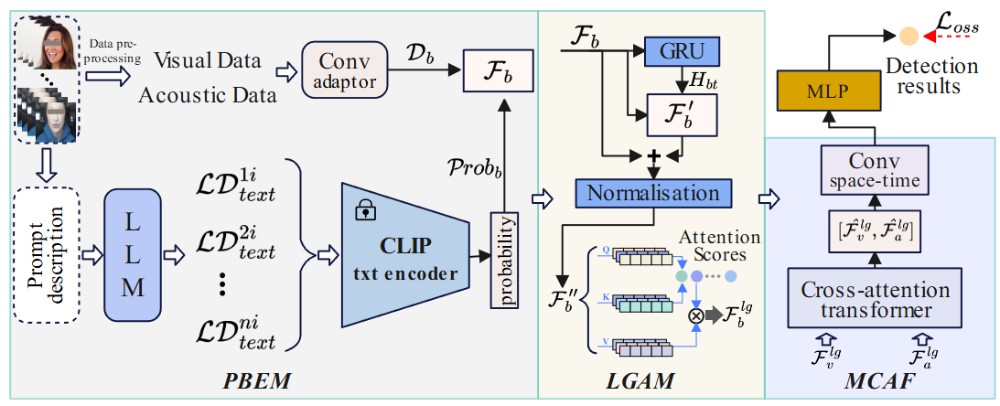

# EPMdd
## Enhanced Prompt-Supervised Multimodal Depression Detection Based on Social Media

The overall framework of the proposed EPMdd method is designed as follows. The probabilistic-based enhancement module (PBEM) aims to effectively alleviate the instability of feature representations caused by low-quality data by leveraging implicit and general prior textual knowledge related to depression. Subsequently, the local-global attention module (LGAM) is employed to extract both local and global temporal information from unimodal data, mitigating to some extent the challenges of model optimization caused by feature space inconsistency between the training and testing sets. Furthermore, a multimodal cross-attention fusion (MCAF) module is introduced to efficiently extract multimodal fused features from visual and auditory modalities. Finally, the fused features are utilized to train an MLP classifier for depression detection.

---

The code is coming soon!
